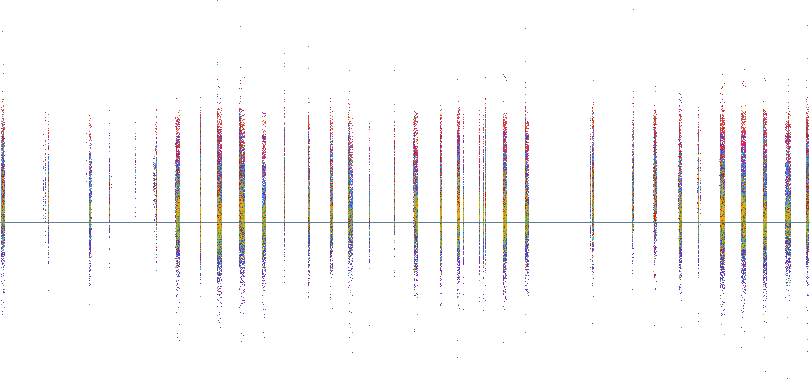
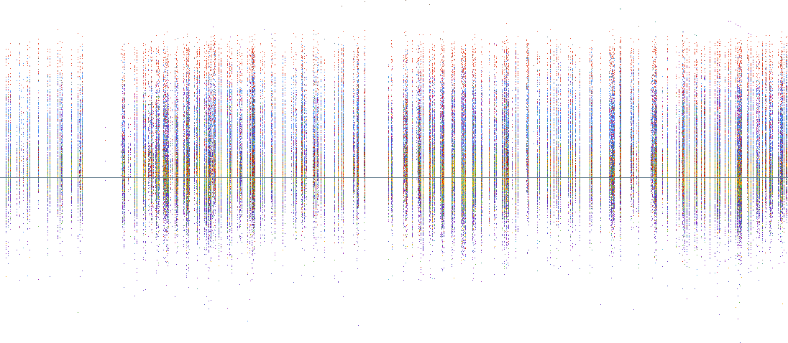
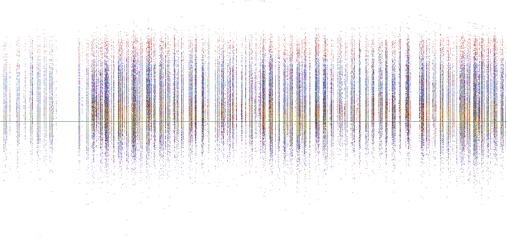
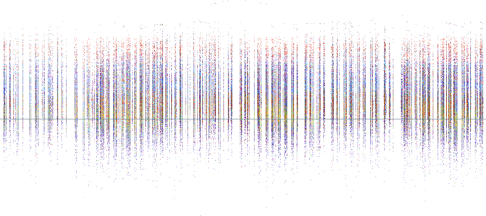
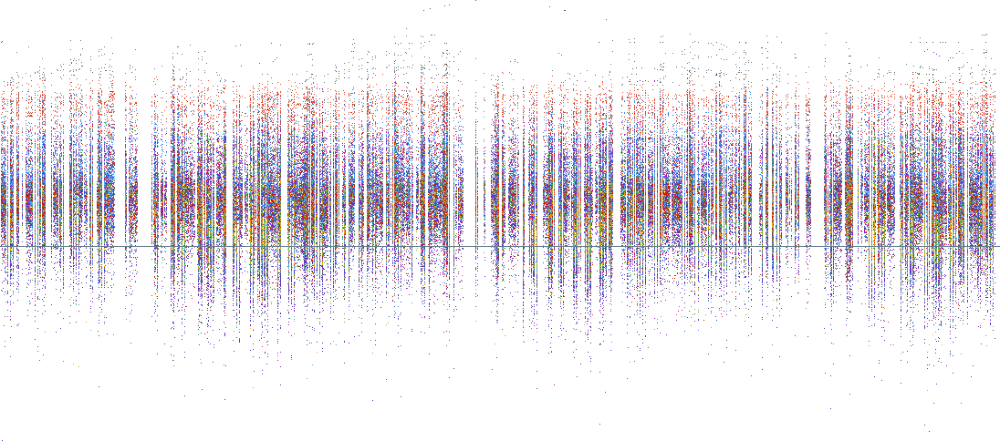
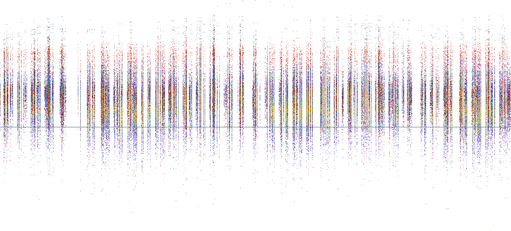

# PLAsTiCC Kaggle Contest

## Data Analysis
### Passband
Vertical axis: relative flux value

Hoziontal axis: mjd (col[0] = fist date of the dataset to col[1096] = last date of the dataset)

One pixel = One measure for an object at the time mjd, the pixel's color represents it class.

#### Passband U

#### Passband G

#### Passband R

#### Passband I

#### Passband Z

#### Passband Y
