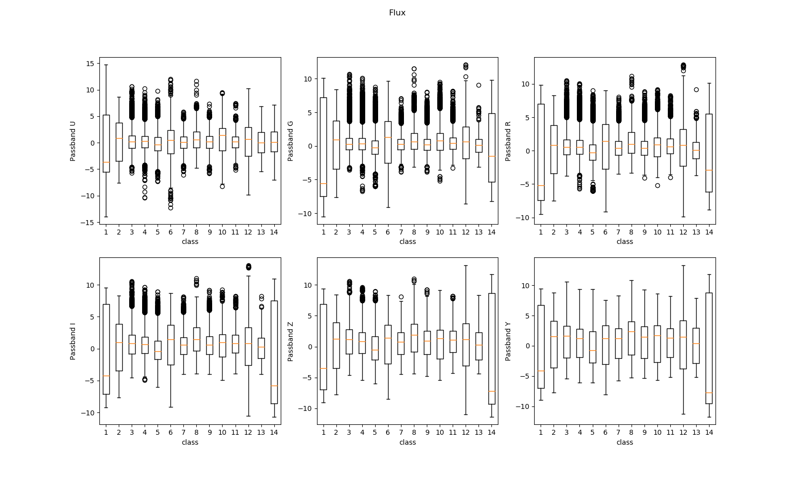
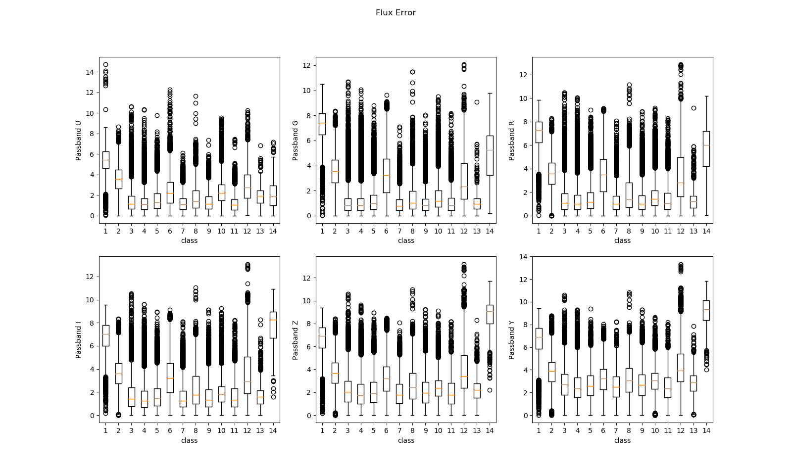
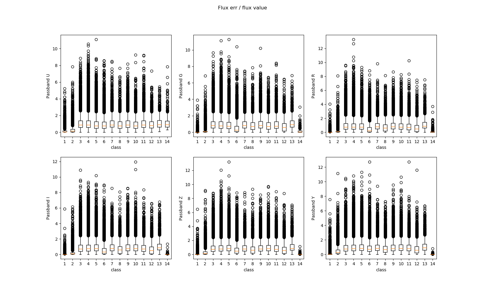
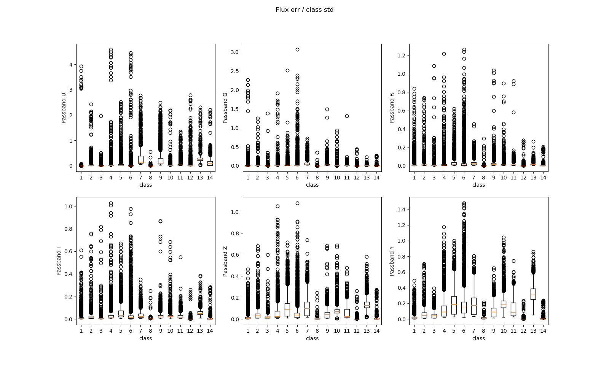
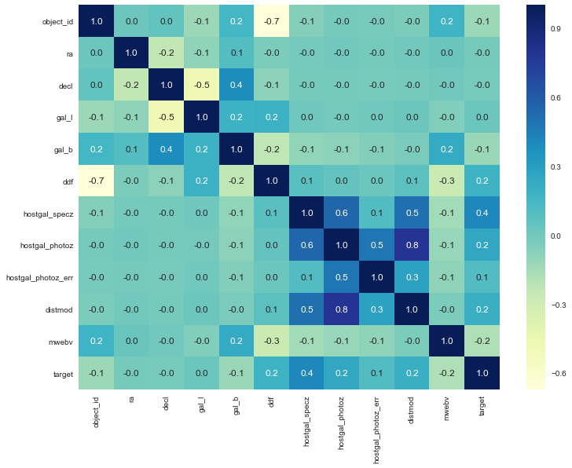
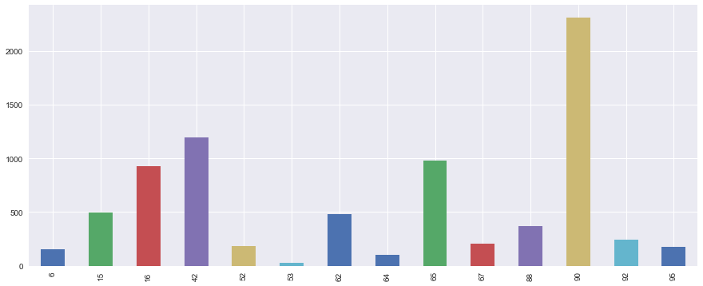
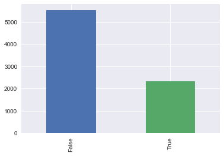

# PLAsTiCC Kaggle Contest

## Data Analysis
### Passband
This graphic represents the distribution of the flux foreach target classes.
The scale used to compute the y axis is :

```python
def rescale(n: float) -> float:
    if n == 0:
        return n
    else:
        if n < 0:
            return -log(1 + -n)
        else:
            return log(1 + n)
```

With this function we have a log rescale that is continue on 0 and accept both positive and negative values.



We can see on the graphic that the classes 1 and 14 have a much more variance other the other classes. We think that the
classes 3, 4, 7, 9, 11 will be hard to distinguish because the have the same profiles.

### Passband Error
**We compute the error as `abs(record.flux_err)`**

It's hard to discuss about this graphic because some flux may have really high values.
So an absolute error analysis may not be meaningful. However we can say that the classes
with the lowest variations (cf. graphic 1) seem to have lower errors.

### Passband Error ratio
**We compute the ratio error as `abs(record.flux_err / record.flux)`**

We can see that the classes 1 and 14 have the lowest ratio `err / flux`. But we also see that a lot of outliers have very
high error ratio (as the scale is in log). But we must be attentive to the fact that some flux values are very close to 0
so a standard flux error for those values will generate a very high ratio. 
Ex : `flux = 0.004, err = 4.85` gives `ratio = 1212.5`


### Passband error over class std
**We compute the ratio as `record.flux_err / std_of_class`**

If we compare the err over the global standard deviation of the target class we obtain that the measures are in general not
really bad but they are a lot of outliers were the error is important.

### Correlation matrix
**High correlation in bright blue**


### Class Distribution


### Intra and Extra galactic class
**Class : [ 6 16 53 65 92] Only intra galaxy **
**Class : [15 42 52 62 64 67 88 90 95] Only extra galaxy **
True = Intra galactic 


